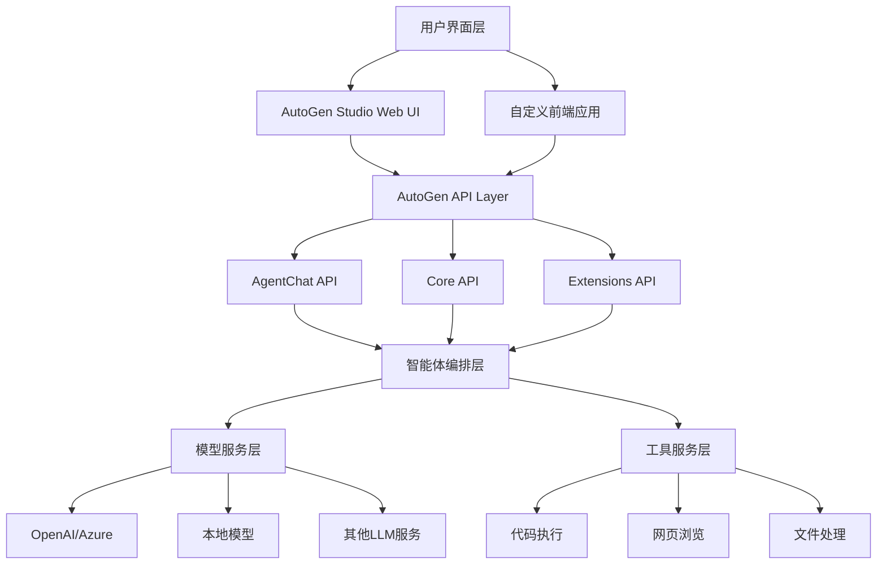

# AutoGen 仓库详细技术分析与前端对接指南

## 目录
1. [仓库概述](#仓库概述)
2. [核心架构分析](#核心架构分析)
3. [产品定位与架构角色](#产品定位与架构角色)
4. [前端开发对接指南](#前端开发对接指南)
5. [API 接口说明](#api-接口说明)
6. [部署与集成方案](#部署与集成方案)
7. [使用示例](#使用示例)

## 仓库概述

### AutoGen 是什么
AutoGen 是 Microsoft 开源的**多智能体AI应用开发框架**，专门用于创建能够自主工作或与人类协作的AI智能体应用。

### 核心功能
- **多智能体协作**: 支持多个AI智能体之间的协作和对话
- **跨语言支持**: 同时支持 Python 和 .NET
- **分层架构设计**: 从底层消息传递到高级对话API
- **无代码GUI**: AutoGen Studio 提供可视化构建界面
- **扩展生态**: 支持各种LLM模型和工具集成

### 仓库结构
```
autogen/
├── python/                 # Python 实现
│   ├── packages/
│   │   ├── autogen-core/           # 核心引擎
│   │   ├── autogen-agentchat/      # 高级对话API
│   │   ├── autogen-ext/            # 扩展包
│   │   ├── autogen-studio/         # Web GUI应用
│   │   ├── magentic-one-cli/       # 命令行工具
│   │   └── agbench/               # 性能基准测试
│   └── samples/                    # 示例代码
├── dotnet/                         # .NET 实现
│   ├── src/                       # 源代码
│   ├── samples/                   # 示例
│   └── test/                      # 测试
├── docs/                          # 文档
└── protos/                        # gRPC 协议定义
```

## 核心架构分析

### 分层架构设计

#### 1. Core API 层 (autogen-core)
**功能**: 提供最底层的消息传递和智能体运行时
- **消息传递系统**: 基于事件驱动的异步消息处理
- **智能体生命周期管理**: 创建、启动、停止智能体
- **分布式运行时**: 支持本地和分布式部署
- **跨语言互操作**: Python 和 .NET 互通

**核心组件**:
```python
# 智能体基类
from autogen_core import Agent, MessageContext
from autogen_core import SingleThreadedAgentRuntime

# 消息类型
from autogen_core import TopicId, MessageType
```

#### 2. AgentChat API 层 (autogen-agentchat)
**功能**: 提供高级对话和群聊功能
- **智能体角色**: AssistantAgent, UserProxyAgent, GroupChatManager
- **对话模式**: 双智能体对话、多智能体群聊
- **终止条件**: 基于文本、轮数、令牌使用量等
- **工具集成**: 代码执行、网页浏览等

**核心组件**:
```python
from autogen_agentchat.agents import AssistantAgent, UserProxyAgent
from autogen_agentchat.teams import RoundRobinGroupChat
from autogen_agentchat.conditions import TextMentionTermination
```

#### 3. Extensions API 层 (autogen-ext)
**功能**: 第三方扩展和特定功能实现
- **LLM 客户端**: OpenAI, Azure OpenAI, Anthropic, Ollama
- **工具扩展**: 网页浏览器、代码执行器、文件处理
- **MCP 集成**: Model Context Protocol 支持

### AutoGen Studio 架构

#### 前端架构 (Gatsby + React)
```typescript
// 主要技术栈
{
  "frontend": {
    "framework": "Gatsby",
    "ui_library": "React + TypeScript",
    "styling": "Tailwind CSS + Ant Design",
    "state_management": "Zustand",
    "editor": "Monaco Editor",
    "icons": "Lucide React + Heroicons"
  }
}
```

#### 后端架构 (FastAPI)
```python
# 主要组件
from fastapi import FastAPI
from fastapi.middleware.cors import CORSMiddleware
from fastapi.staticfiles import StaticFiles

# 核心模块
- 认证系统 (auth/)
- 数据库管理 (database/)
- API 路由 (routes/)
- 团队管理 (teammanager/)
- 会话管理 (session/)
```

## 产品定位与架构角色

### 在企业架构中的定位



### 产品角色定义

1. **AI 智能体编排平台**: 不是单纯的聊天机器人，而是多智能体协作的编排平台
2. **中间件层**: 位于AI模型服务和业务应用之间的中间件
3. **开发框架**: 为开发者提供构建AI应用的框架和工具
4. **无代码平台**: AutoGen Studio 提供可视化构建能力

## 前端开发对接指南

### 1. 技术栈要求

#### 推荐技术栈
```json
{
  "frontend": {
    "framework": ["React", "Vue", "Angular"],
    "typescript": "必需",
    "websocket": "推荐 (实时通信)",
    "http_client": ["axios", "fetch"],
    "state_management": ["Redux", "Zustand", "Pinia"]
  }
}
```

#### 必需依赖
```bash
# HTTP 客户端
npm install axios
# WebSocket 支持
npm install socket.io-client
# 类型定义
npm install @types/node
```

### 2. 核心数据模型

#### 智能体 (Agent) 模型
```typescript
interface AgentConfig {
  name: string;
  description?: string;
  model_client?: ModelConfig;
  tools?: ToolConfig[];
  system_message?: string;
  max_turns?: number;
}

interface ModelConfig {
  provider: "openai" | "azure" | "anthropic" | "ollama";
  model: string;
  api_key?: string;
  base_url?: string;
  temperature?: number;
  max_tokens?: number;
}
```

#### 团队 (Team) 模型
```typescript
interface TeamConfig {
  name: string;
  agents: AgentConfig[];
  workflow: "sequential" | "round_robin" | "group_chat";
  termination_condition?: TerminationConfig;
  max_rounds?: number;
}

interface TerminationConfig {
  type: "max_messages" | "text_mention" | "timeout" | "token_usage";
  config: Record<string, any>;
}
```

#### 会话 (Session) 模型
```typescript
interface Session {
  id: string;
  team_id: string;
  status: "active" | "completed" | "error";
  created_at: string;
  updated_at: string;
  messages: Message[];
}

interface Message {
  id: string;
  source: string;
  content: string | MultiModalContent[];
  timestamp: string;
  metadata?: Record<string, any>;
}
```

### 3. API 客户端封装

#### AutoGen API 客户端
```typescript
class AutoGenClient {
  private baseURL: string;
  private apiKey?: string;
  private wsConnection?: WebSocket;

  constructor(config: {
    baseURL: string;
    apiKey?: string;
  }) {
    this.baseURL = config.baseURL;
    this.apiKey = config.apiKey;
  }

  // 团队管理
  async createTeam(team: TeamConfig): Promise<Team> {
    const response = await axios.post(`${this.baseURL}/teams`, team, {
      headers: this.getHeaders(),
    });
    return response.data;
  }

  async getTeams(userId: string): Promise<Team[]> {
    const response = await axios.get(`${this.baseURL}/teams`, {
      params: { user_id: userId },
      headers: this.getHeaders(),
    });
    return response.data.data;
  }

  // 会话管理
  async createSession(teamId: string): Promise<Session> {
    const response = await axios.post(`${this.baseURL}/sessions`, {
      team_id: teamId,
    }, {
      headers: this.getHeaders(),
    });
    return response.data;
  }

  async sendMessage(sessionId: string, message: string): Promise<void> {
    await axios.post(`${this.baseURL}/sessions/${sessionId}/messages`, {
      content: message,
    }, {
      headers: this.getHeaders(),
    });
  }

  // WebSocket 连接
  connectWebSocket(sessionId: string, onMessage: (message: Message) => void): void {
    this.wsConnection = new WebSocket(`${this.baseURL.replace('http', 'ws')}/ws/${sessionId}`);
    
    this.wsConnection.onmessage = (event) => {
      const message = JSON.parse(event.data);
      onMessage(message);
    };
  }

  private getHeaders() {
    return {
      'Content-Type': 'application/json',
      ...(this.apiKey && { 'Authorization': `Bearer ${this.apiKey}` }),
    };
  }
}
```

### 4. React 组件示例

#### 智能体聊天组件
```typescript
import React, { useState, useEffect } from 'react';
import { AutoGenClient } from './autoGenClient';

interface ChatInterfaceProps {
  teamId: string;
  userId: string;
}

export const ChatInterface: React.FC<ChatInterfaceProps> = ({ teamId, userId }) => {
  const [session, setSession] = useState<Session | null>(null);
  const [messages, setMessages] = useState<Message[]>([]);
  const [input, setInput] = useState('');
  const [loading, setLoading] = useState(false);

  const client = new AutoGenClient({
    baseURL: 'http://localhost:8080/api',
  });

  useEffect(() => {
    initializeSession();
  }, [teamId]);

  const initializeSession = async () => {
    try {
      const newSession = await client.createSession(teamId);
      setSession(newSession);
      
      // 连接 WebSocket
      client.connectWebSocket(newSession.id, (message) => {
        setMessages(prev => [...prev, message]);
      });
    } catch (error) {
      console.error('Failed to initialize session:', error);
    }
  };

  const sendMessage = async () => {
    if (!session || !input.trim()) return;

    setLoading(true);
    try {
      await client.sendMessage(session.id, input);
      setInput('');
    } catch (error) {
      console.error('Failed to send message:', error);
    } finally {
      setLoading(false);
    }
  };

  return (
    <div className="chat-interface">
      <div className="messages">
        {messages.map((message) => (
          <div key={message.id} className={`message ${message.source}`}>
            <strong>{message.source}:</strong>
            <span>{message.content}</span>
          </div>
        ))}
      </div>
      
      <div className="input-area">
        <input
          type="text"
          value={input}
          onChange={(e) => setInput(e.target.value)}
          onKeyPress={(e) => e.key === 'Enter' && sendMessage()}
          disabled={loading}
          placeholder="输入消息..."
        />
        <button onClick={sendMessage} disabled={loading || !input.trim()}>
          发送
        </button>
      </div>
    </div>
  );
};
```

#### 团队构建器组件
```typescript
interface TeamBuilderProps {
  onTeamCreated: (team: Team) => void;
}

export const TeamBuilder: React.FC<TeamBuilderProps> = ({ onTeamCreated }) => {
  const [teamConfig, setTeamConfig] = useState<TeamConfig>({
    name: '',
    agents: [],
    workflow: 'round_robin',
  });

  const addAgent = () => {
    const newAgent: AgentConfig = {
      name: `Agent ${teamConfig.agents.length + 1}`,
      description: '',
    };
    
    setTeamConfig(prev => ({
      ...prev,
      agents: [...prev.agents, newAgent],
    }));
  };

  const updateAgent = (index: number, agent: AgentConfig) => {
    setTeamConfig(prev => ({
      ...prev,
      agents: prev.agents.map((a, i) => i === index ? agent : a),
    }));
  };

  const createTeam = async () => {
    try {
      const client = new AutoGenClient({
        baseURL: 'http://localhost:8080/api',
      });
      
      const team = await client.createTeam(teamConfig);
      onTeamCreated(team);
    } catch (error) {
      console.error('Failed to create team:', error);
    }
  };

  return (
    <div className="team-builder">
      <h2>创建智能体团队</h2>
      
      <div className="team-config">
        <input
          type="text"
          placeholder="团队名称"
          value={teamConfig.name}
          onChange={(e) => setTeamConfig(prev => ({ ...prev, name: e.target.value }))}
        />
        
        <select
          value={teamConfig.workflow}
          onChange={(e) => setTeamConfig(prev => ({ ...prev, workflow: e.target.value as any }))}
        >
          <option value="sequential">顺序执行</option>
          <option value="round_robin">轮流对话</option>
          <option value="group_chat">群聊模式</option>
        </select>
      </div>

      <div className="agents-section">
        <h3>智能体配置</h3>
        {teamConfig.agents.map((agent, index) => (
          <AgentEditor
            key={index}
            agent={agent}
            onChange={(updatedAgent) => updateAgent(index, updatedAgent)}
          />
        ))}
        
        <button onClick={addAgent}>添加智能体</button>
      </div>

      <button onClick={createTeam} disabled={!teamConfig.name || teamConfig.agents.length === 0}>
        创建团队
      </button>
    </div>
  );
};
```

## API 接口说明

### 认证相关
```
POST /auth/login           # 用户登录
POST /auth/logout          # 用户登出
GET  /auth/user            # 获取用户信息
```

### 团队管理
```
GET    /api/teams          # 获取团队列表
POST   /api/teams          # 创建团队
GET    /api/teams/{id}     # 获取团队详情
PUT    /api/teams/{id}     # 更新团队
DELETE /api/teams/{id}     # 删除团队
```

### 会话管理
```
GET    /api/sessions       # 获取会话列表
POST   /api/sessions       # 创建会话
GET    /api/sessions/{id}  # 获取会话详情
DELETE /api/sessions/{id}  # 删除会话
```

### 消息处理
```
POST   /api/sessions/{id}/messages  # 发送消息
GET    /api/sessions/{id}/messages  # 获取消息历史
```

### WebSocket 连接
```
WS     /ws/{session_id}    # 实时消息流
```

### 配置管理
```
GET    /api/settings       # 获取系统设置
PUT    /api/settings       # 更新系统设置
```

## 部署与集成方案

### 1. 独立部署方案

#### Docker 部署
```yaml
# docker-compose.yml
version: '3.8'
services:
  autogen-studio:
    image: autogen-studio:latest
    ports:
      - "8080:8080"
    environment:
      - DATABASE_URL=sqlite:///app.db
      - OPENAI_API_KEY=${OPENAI_API_KEY}
    volumes:
      - ./data:/app/data
```

#### 环境变量配置
```bash
# .env
AUTOGENSTUDIO_HOST=0.0.0.0
AUTOGENSTUDIO_PORT=8080
DATABASE_URL=sqlite:///data/autogen.db
OPENAI_API_KEY=your_openai_api_key
AZURE_OPENAI_API_KEY=your_azure_key
```

### 2. 嵌入式集成方案

#### 作为微服务集成
```typescript
// 在现有应用中集成 AutoGen
class MyApplication {
  private autoGenService: AutoGenClient;

  constructor() {
    this.autoGenService = new AutoGenClient({
      baseURL: 'http://autogen-service:8080/api',
      apiKey: process.env.AUTOGEN_API_KEY,
    });
  }

  async createAIAssistant(requirements: any) {
    // 根据需求自动创建智能体团队
    const teamConfig = this.generateTeamConfig(requirements);
    const team = await this.autoGenService.createTeam(teamConfig);
    return team;
  }

  async processUserQuery(query: string, teamId: string) {
    const session = await this.autoGenService.createSession(teamId);
    await this.autoGenService.sendMessage(session.id, query);
    return session;
  }
}
```

#### iframe 嵌入方案
```html
<!-- 直接嵌入 AutoGen Studio -->
<iframe
  src="http://autogen-studio:8080"
  width="100%"
  height="600px"
  frameborder="0">
</iframe>
```

### 3. API 代理方案
```typescript
// API 代理服务
import express from 'express';
import { createProxyMiddleware } from 'http-proxy-middleware';

const app = express();

// 代理 AutoGen API
app.use('/autogen', createProxyMiddleware({
  target: 'http://autogen-studio:8080',
  changeOrigin: true,
  pathRewrite: {
    '^/autogen': '/api'
  },
  // 添加认证头
  onProxyReq: (proxyReq, req, res) => {
    proxyReq.setHeader('Authorization', `Bearer ${process.env.AUTOGEN_TOKEN}`);
  }
}));
```

## 使用示例

### 1. 快速开始示例

#### Python 脚本集成
```python
import asyncio
from autogen_agentchat.agents import AssistantAgent, UserProxyAgent
from autogen_agentchat.teams import RoundRobinGroupChat
from autogen_ext.models.openai import OpenAIChatCompletionClient

async def create_simple_team():
    # 创建模型客户端
    model_client = OpenAIChatCompletionClient(
        model="gpt-4",
        api_key="your-api-key"
    )
    
    # 创建智能体
    assistant = AssistantAgent(
        name="assistant",
        model_client=model_client,
        system_message="你是一个有用的AI助手"
    )
    
    user_proxy = UserProxyAgent(
        name="user",
        human_input_mode="ALWAYS"
    )
    
    # 创建团队
    team = RoundRobinGroupChat([assistant, user_proxy])
    
    # 开始对话
    result = await team.run(task="帮我写一个Python函数")
    return result

# 运行
asyncio.run(create_simple_team())
```

#### 网页浏览智能体示例
```python
from autogen_ext.agents.web_surfer import MultimodalWebSurfer

async def create_web_research_team():
    model_client = OpenAIChatCompletionClient(model="gpt-4o")
    
    # 网页浏览智能体
    web_surfer = MultimodalWebSurfer(
        "researcher", 
        model_client,
        headless=False,  # 显示浏览器窗口
        animate_actions=True
    )
    
    user_proxy = UserProxyAgent("user")
    
    team = RoundRobinGroupChat([web_surfer, user_proxy])
    
    try:
        await team.run(task="搜索最新的AI技术发展动态并总结")
    finally:
        await web_surfer.close()
        await model_client.close()
```

### 2. 高级集成示例

#### 自定义智能体
```python
from autogen_core import BaseAgent, MessageContext

class CustomDataAnalystAgent(BaseAgent):
    def __init__(self, name: str, model_client):
        super().__init__(name)
        self.model_client = model_client
        
    async def handle_message(self, message: Any, ctx: MessageContext) -> None:
        # 自定义数据分析逻辑
        if "analyze" in message.content:
            # 执行数据分析
            result = await self.perform_analysis(message.content)
            await ctx.send_response(result)
    
    async def perform_analysis(self, query: str):
        # 实现具体的数据分析逻辑
        prompt = f"分析以下数据请求：{query}"
        response = await self.model_client.complete(prompt)
        return response
```

#### 工具集成示例
```python
from autogen_ext.tools import PythonCodeExecutorTool

async def create_coding_team():
    # 代码执行工具
    code_executor = PythonCodeExecutorTool()
    
    # 编程智能体
    coder = AssistantAgent(
        name="coder",
        model_client=model_client,
        tools=[code_executor],
        system_message="你是一个Python编程专家"
    )
    
    # 代码审查智能体
    reviewer = AssistantAgent(
        name="reviewer",
        model_client=model_client,
        system_message="你是代码审查专家，负责检查代码质量"
    )
    
    team = RoundRobinGroupChat([coder, reviewer])
    await team.run(task="编写一个排序算法并优化")
```

### 3. 前端完整示例

#### React + TypeScript 完整应用
```typescript
// App.tsx
import React, { useState } from 'react';
import { TeamBuilder } from './components/TeamBuilder';
import { ChatInterface } from './components/ChatInterface';
import { AutoGenClient } from './services/autoGenClient';

const App: React.FC = () => {
  const [currentTeam, setCurrentTeam] = useState<Team | null>(null);
  const [user] = useState({ id: 'user-123' });

  return (
    <div className="app">
      <header>
        <h1>AutoGen 智能体平台</h1>
      </header>
      
      <main>
        {!currentTeam ? (
          <TeamBuilder onTeamCreated={setCurrentTeam} />
        ) : (
          <ChatInterface 
            teamId={currentTeam.id} 
            userId={user.id}
            onBack={() => setCurrentTeam(null)}
          />
        )}
      </main>
    </div>
  );
};

export default App;
```

## 总结

### AutoGen 的核心价值
1. **降低AI应用开发门槛**: 提供高级抽象和无代码工具
2. **多智能体协作**: 解决复杂任务需要多种专业能力的问题
3. **可扩展架构**: 支持自定义智能体和工具集成
4. **跨平台支持**: Python 和 .NET 双语言支持

### 前端开发者关键要点
1. **API 优先**: 通过 REST API 和 WebSocket 与后端通信
2. **类型安全**: 使用 TypeScript 确保类型安全
3. **实时通信**: WebSocket 支持实时消息流
4. **模块化设计**: 组件化的智能体和工具管理
5. **配置驱动**: 通过配置而非代码定义智能体行为

### 典型应用场景
- **企业AI助手**: 客服、销售、技术支持
- **内容创作平台**: 多智能体协作创作
- **数据分析工具**: 自动化数据处理和报告生成
- **教育平台**: AI导师和学习助手
- **开发工具**: 代码生成、审查、测试自动化

AutoGen 提供了完整的多智能体AI应用开发解决方案，前端开发者可以通过其提供的API快速构建具有AI能力的应用程序。